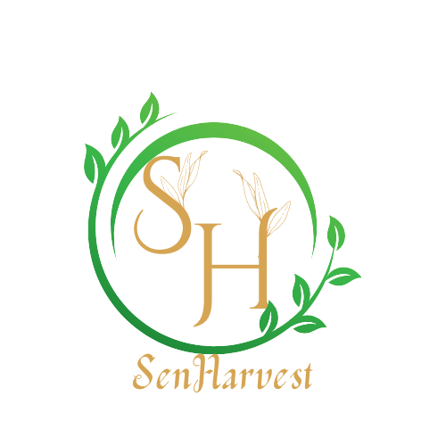

# 🌾 SenHarvest Group - Agricultural Import/Export Platform



A modern, responsive React website for **SenHarvest Group** - an agricultural commodities intermediation and brokerage firm connecting African, Asian, and North American markets.

## 🌟 Features

- 🌐 **Bilingual Support** - French and English language toggle
- 📱 **Responsive Design** - Mobile-first approach with Tailwind CSS
- 🛒 **Product Catalog** - 10+ agricultural products with pricing
- 📞 **Contact Integration** - WhatsApp, email, and contact form
- 🎨 **Modern UI** - Clean, professional design with smooth animations
- ♿ **Accessible** - WCAG compliant with proper ARIA labels
- 🔍 **SEO Optimized** - Meta tags, structured data, and semantic HTML
- 📊 **Admin Panel** - Proforma invoice generation and management
- 🔥 **Firebase Integration** - Real-time data storage and management
- 📈 **Analytics** - Google Analytics 4 integration

## 🚀 Quick Start

### Prerequisites
- Node.js 16+ and npm
- Firebase account (optional)
- Git

### Installation

1. **Clone the repository**
   ```bash
   git clone https://github.com/senharvestlo/senharvest-optimized-code.git
   cd senharvest-optimized-code
   ```

2. **Install Dependencies**
   ```bash
   npm install
   ```

3. **Environment Setup**
   ```bash
   cp env.example .env
   # Edit .env with your actual values
   ```

4. **Start Development Server**
   ```bash
   npm start
   ```
   Open [http://localhost:3000](http://localhost:3000) to view it in the browser.

5. **Build for Production**
   ```bash
   npm run build
   ```

## 🏗️ Project Structure

```
src/
├── components/
│   ├── layout/          # Header, Footer, WhatsApp Float
│   ├── pages/           # Home, Products, Services, Mission, Contact, Admin
│   └── ui/              # Reusable UI components
├── config/
│   ├── company.js       # Company information and settings
│   ├── products.js      # Product catalog and translations
│   ├── translations.js  # French/English translations
│   ├── analytics.js     # Google Analytics configuration
│   ├── firebase.js      # Firebase configuration
│   └── email.js         # Email service configuration
├── hooks/
│   └── useLang.js       # Language management hook
├── services/
│   └── firebaseService.js # Firebase database operations
├── utils/
│   ├── emailService.js  # Email utilities
│   ├── seo.js          # SEO utilities
│   └── whatsapp.js     # WhatsApp link generation
└── App.js              # Main application component
```

## 🌍 Products & Markets

### Export Products (from Senegal/Africa)
- 🥜 **Peanuts** - Premium quality groundnuts
- 🌰 **Cashew Nuts** - Raw and processed varieties
- 🌱 **Sesame Seeds** - High-grade organic sesame
- 🍫 **Cocoa Beans** - Fair trade certified
- 🥭 **Kent Mangoes** - Fresh tropical fruits

### Import Products (to Africa)
- 🌾 **Wheat Flour** - Food-grade from Canada
- 🫘 **Pulses** - Lentils, peas, beans from Canada
- 🛢️ **Canola Oil** - Premium cooking oil from Canada
- 🍚 **Fragrant Rice** - Basmati and broken rice from Asia

## 🔧 Customization

### Company Information
Edit `src/config/company.js` to update:
- Company name and tagline
- Contact information
- Logo and branding
- Addresses and phone numbers

### Products
Modify `src/config/products.js` to:
- Add/remove products
- Update pricing and MOQ
- Change product images
- Add new product categories

### Translations
Update `src/config/translations.js` to:
- Add new languages
- Modify existing translations
- Add new text content

### Styling
Customize `tailwind.config.js` to:
- Change color scheme
- Modify typography
- Add custom components

## 🌐 Environment Variables

| Variable | Description | Example |
|----------|-------------|---------|
| `REACT_APP_PHONE_SN` | Senegal phone number | `+221776340064` |
| `REACT_APP_PHONE_CA` | Canada phone number | `+18193198464` |
| `REACT_APP_EMAIL` | Contact email | `abdoulahat.lo@senharvest.com` |
| `REACT_APP_WHATSAPP` | WhatsApp number | `+221776340064` |
| `REACT_APP_FORMSPREE_ID` | Formspree form ID | `xqkrpozn` |

## 🚀 Deployment

### Netlify
1. Connect your GitHub repository
2. Set build command: `npm run build`
3. Set publish directory: `build`
4. Add environment variables in Netlify dashboard

### Vercel
1. Import your GitHub repository
2. Framework preset: Create React App
3. Add environment variables in Vercel dashboard

### Traditional Hosting
1. Run `npm run build`
2. Upload `build` folder contents to your web server
3. Configure server to serve `index.html` for all routes

## 📧 Form Integration

The contact form is configured to work with Formspree. To set up:

1. Create a Formspree account
2. Create a new form
3. Update `REACT_APP_FORMSPREE_ID` in your `.env` file
4. Update the form endpoint in `src/utils/emailService.js`

## 🔥 Firebase Setup

1. Create a Firebase project
2. Enable Firestore Database
3. Update Firebase configuration in `src/config/firebase.js`
4. Set up Firestore security rules

## 📊 Admin Features

Access the admin panel by triple-clicking the logo. Features include:

- **Proforma Generation** - Create professional invoices
- **Product Management** - Add references and track inventory
- **Firebase Integration** - Real-time data synchronization
- **Export Options** - PDF generation and printing

## 🌐 Browser Support

- Chrome (latest)
- Firefox (latest)
- Safari (latest)
- Edge (latest)
- Mobile browsers (iOS Safari, Chrome Mobile)

## 🏢 Company Structure

- **🇺🇸 SenHarvest LLC** - Delaware, USA (Headquarters)
- **🇨🇦 Xidma & Harvest Canada** - Montreal, Canada (Operations)
- **🇸🇳 Xidma & Harvest SARL** - Dakar, Senegal (Local Operations)

## 📞 Contact & Support

- **Email:** abdoulahat.lo@senharvest.com
- **WhatsApp:** +221 77 634 00 64
- **Canada:** +1 819 319 84 64
- **Website:** [xidmaharvest.com](https://xidmaharvest.com)

## 🤝 Contributing

1. Fork the repository
2. Create a feature branch (`git checkout -b feature/amazing-feature`)
3. Commit your changes (`git commit -m 'Add some amazing feature'`)
4. Push to the branch (`git push origin feature/amazing-feature`)
5. Open a Pull Request

## 📄 License

This project is proprietary software for SenHarvest Group. All rights reserved.

## 🔮 Roadmap

- [ ] Multi-currency pricing
- [ ] Real-time chat support
- [ ] Mobile app development
- [ ] Blockchain supply chain tracking
- [ ] AI-powered market analysis
- [ ] B2B marketplace expansion

---

**🌾 "Cultivating prosperity across continents – Sow locally, Harvest globally!"**

Made with ❤️ by the SenHarvest Team